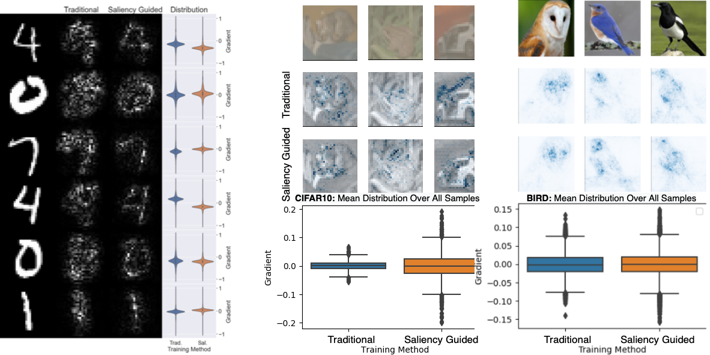

# Saliency Guided Training
Code implementing "Improving Deep Learning Interpretability by Saliency Guided Training" by Aya Abdelsalam Ismail, Hector Corrada Bravo*, Soheil Feizi*.




## Overview

Saliency methods have been widely used to highlight important input features in model predictions. Most existing methods use backpropagation on a modified gradient function to generate saliency maps. Thus, noisy gradients can result in unfaithful feature attributions. In this paper, we tackle this issue and introduce a saliency guided training† procedure for neural networks to reduce noisy gradients used in predictions while retaining the predictive performance of the model. Our saliency guided training procedure iteratively masks features with small and potentially noisy gradients while maximizing the similarity of model outputs for both
masked and unmasked inputs. We apply the saliency guided training procedure to various synthetic and real data sets from computer vision, natural language processing, and time series across diverse neural architectures, including Recurrent Neural Networks, Convolutional Networks, and Transformers. Through qualitative and quantitative evaluations, we show that saliency guided training procedure significantly improves model interpretability across various domains while preserving its predictive performance.


 ## Usage:
- Create the following folder structure.
```
Scripts
    │
    ├── data
    ├── models
    └── outputs 
      ├── SaliencyValues
      ├── MaskedAcc
      └──Graphs
```
- To run experiment cd  Scripts 
 ### For MNIST Regular Training
- For MNIST Experiments run regular training:  ```python train_MNIST.py ```
- To get accuracy drop run: ```python maskedAcc_MNIST.py``` 
 ### For MNIST Interpretable Training
- Add interpretable training flags, here 50% of the features are masked during training with a random. <br />
   ```python train_MNIST.py  --trainingType interpretable --featuresDroped 0.5 --RandomMasking ```
- To get accuracy drop run with the same flags used in training: <br />
	```python maskedAcc_MNIST.py --trainingType interpretable --featuresDroped 0.5 --RandomMasking ```


